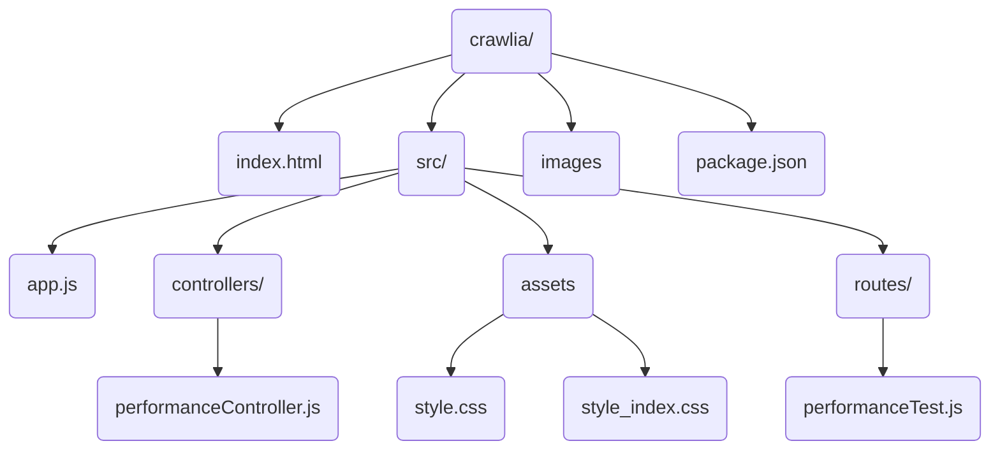

# Crawlia

**Crawlia** est un outil d'analyse web pou analyser les performances des  pages web elle mesure le temps jusqu’au premier octet (TTFB) et elle vérifie attributs SEO et détecte aussi lien morts

## 1-Architecture du project:

**A- Node modules/** :

il  contient tous les modules et dépendances installés

**B-src/** 
: il contient les dossiers

1. **Controllers/** : 
- `performanceController.js` : Ce fichier contient  la logique du contrôleur pour gérer les requêtes de performance
2. **routes/** :
- `performanceTest.js` :
     Ce fichier définit les routes de notre  application
3. **app.js** :Fichier configuration de votre application Node.js 

**C- Package-lock.json** et **package.json** :
 Contient les informations de configuration de votre projet, y compris les dépendances nécessaires
.

## 2-installation :

1-Clonez le Project dans votre répertoire local :

`git clone https://github.com/moumouidir/Crawlia.git`

2-installation du module:

`npm install`

3-demarre le serveur :

`node src/app.js`

4-Accéder  dans le  navigateur : 

[http://localhost:4000](http://localhost:4000/)

## 3- Fonctionnalité :

**Mesure du TTFB** : Elle mesure le délai entre la requête d'une ressource et le moment où le premier octet d'une réponse commence à arriver

**Vérification des attributs SEO** : Contrôlez balises, titres et images qui n’ont alt

**Détection des liens morts :**  vérifie les liens  et détecte les lien morts

**Vérification SSL** : Vérifie la validité du certificat SSL du site

## 4- Les Module et  Bibliothèques:

**Express.js** : est un framework web  puissant pour Node.js elle nous permis de construire notre serveur

**Cheerio** :cette  bibliothèques nous permet de sélectionner, manipuler et analyser le contenu HTML de manière simple et efficace. elle est  utilise pour le web scraping et la transformation de données HTML.

**Axios** : est une bibliothèque HTTP client pour Node.js qui facilite les requêtes HTTP asynchrones